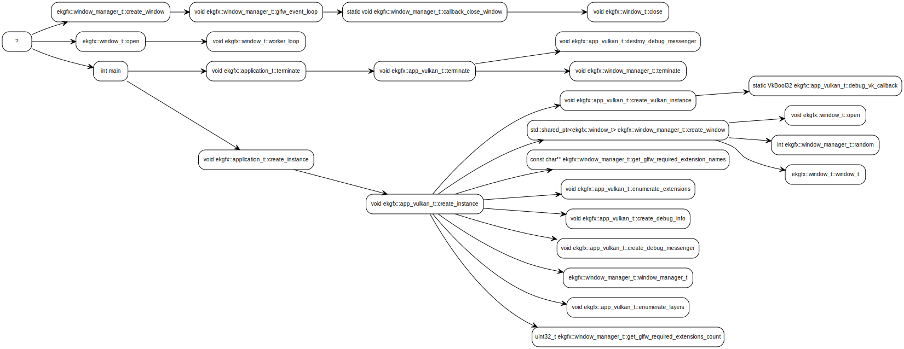

# ketrace - A yuml markup and log file generating tracing library

C++ Tracing Library which also generates yuml markup and will flush the traces to a log file


# Build

Include the source files in your project


# Example

```c++

#include "trace.h"

window_t::window_t( GLFWwindow* glfw_window, double unique_id )
{
    TRACE;

    window = glfw_window;
    id     = unique_id;
    id_str = "Window id " + std::to_string( id );
    status = status_t::ZOMBIE;
}

void window_t::open()
{
    TRACE;

    trace.set_error_handler(
        [ & ]()
        {
            if ( status == status_t::OPEN )
            {
                worker_thread.request_stop();
            }
            return error_handler_result_t::result_continue;
        } );

    switch ( status )
    {
        case status_t::ZOMBIE:
            trace.info( "Opening window " + id_str );

            status = status_t::OPEN;

            worker_thread = std::jthread(
                [ & ]( std::stop_token stop_token )
                {
                    trace_t thread_trace( __PRETTY_FUNCTION__, id_str );
                    worker_loop( stop_token );
                } );
            break;
        case status_t::CLOSED:
            trace.error( "A closed window cannot be reopened" );
            break;
        default:
            trace.error( "Unhandled window state" );
            break;
    }
}
```

## Sample rendered yuml

You can use VSCode or some other open source renderers.
See suggested tools in there 'Reference' section.



## Sample logs

``` Text

[glfw_event_loop]info:  void ekgfx::window_manager_t::glfw_event_loop(std::stop_token&):
       Starting Window Manager event polling


[glfw_event_loop]info:  void ekgfx::window_t::close():
       Window Window id 605 is being closed


[glfw_event_loop]info:  void ekgfx::window_manager_t::glfw_event_loop(std::stop_token&):
       Exiting gracefully


[Window id 605]info:  void ekgfx::window_t::worker_loop(std::stop_token&):
       Starting window Window id 605 event loop


[Window id 605]info:  void ekgfx::window_t::worker_loop(std::stop_token&):
       Window Window id 605 closed gracefully


[Main]info:  void ekgfx::app_vulkan_t::enumerate_extensions():
       Available Vulkan Extensions:


[Main]info:  void ekgfx::app_vulkan_t::enumerate_extensions():
       VK_KHR_device_group_creation version 1

...
...

[Main]info:  int main():
       Success
```

# References

| Name  | Link |
| ------------- | ------------- |
| yuml  | https://yuml.me/  |
| Visual Studio Code  | https://github.com/Microsoft/vscode  |
| yUML diagrammer | https://github.com/jaime-olivares/yuml-diagram |

# License

[MIT](https://github.com/microsoft/vscode/blob/main/LICENSE.txt)